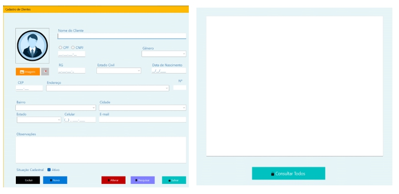

Português | English

# Português

# Aplicação de Gerenciamento de Clientes (.NET WinForms)

Uma **aplicação desktop** desenvolvida com **C# e Windows Forms (.NET Framework)** para gerenciar registros de clientes armazenados em um **banco de dados MySQL**.

O sistema fornece uma interface gráfica intuitiva que permite **criar, buscar, atualizar e excluir registros de clientes** de forma eficiente. O projeto foi desenvolvido para fins acadêmicos com o objetivo de praticar **desenvolvimento de aplicações desktop, integração com banco de dados e operações CRUD**.

---

# Funcionalidades

- Cadastro de clientes com informações pessoais e de endereço
- Busca de clientes por **nome ou CPF**
- Atualização de registros existentes
- Exclusão de clientes
- Integração com **banco de dados MySQL**
- Interface gráfica desktop desenvolvida com **Windows Forms**
- Implementação de operações **CRUD**
- Interface simples e intuitiva para gerenciamento de dados

---

# Tecnologias Utilizadas

- **C#**
- **.NET Framework (Windows Forms)**
- **MySQL**
- **MySql.Data.MySqlClient (Pacote NuGet)**
- **Visual Studio**

---

# Formulário de Cadastro de Clientes



---

# Estrutura do Projeto

```
Customer_Management_Application/
│
├── Form1.cs # Interface principal da aplicação
├── Program.cs # Ponto de entrada da aplicação
├── Resources/ # Imagens utilizadas pela interface
├── Properties/
│ └── Resources.resx
└── Database Script # Script SQL para criação da tabela
```

---

# Operações CRUD

A aplicação implementa as quatro operações fundamentais de banco de dados:

| Operação | Descrição |
|----------|-------------|
| **Create** | Cadastrar um novo cliente |
| **Read** | Buscar clientes por nome ou CPF |
| **Update** | Editar informações de um cliente |
| **Delete** | Remover um cliente do banco de dados |

---

# Estrutura do Banco de Dados

A aplicação utiliza uma **tabela MySQL** para armazenar as informações dos clientes.

```sql
CREATE TABLE clientes (
  id INT AUTO_INCREMENT PRIMARY KEY,
  nome VARCHAR(100),
  cpf VARCHAR(14),
  estado_civil VARCHAR(20),
  genero VARCHAR(10),
  rua VARCHAR(100),
  numero VARCHAR(10),
  bairro VARCHAR(50),
  cidade VARCHAR(50),
  estado VARCHAR(2)
);
```

# Como Executar o Projeto

- Clone o repositório: git clone https://github.com/diegobrsantosdev/customer-management-winforms.git
- Abra o arquivo .sln no Visual Studio.
- Certifique-se de que o MySQL Server está instalado e em execução.
- Crie o banco de dados e a tabela utilizando o script SQL fornecido.
- Atualize a string de conexão do MySQL dentro do arquivo Form1.cs com suas credenciais: string connectionString = "server=localhost;database=clientes;user=root;password=your_password;"
- Instale o pacote NuGet: MySql.Data
- Execute a aplicação pressionando F5 no Visual Studio.

---

## Contato

Diego Santos

[E-mail](mailto:diegobrsantosdev@gmail.com)                                                   [LinkedIn](https://www.linkedin.com/in/diegobrsantos/)

---

# English

# Customer Management Application (.NET WinForms)

A **desktop application** developed with **C# and Windows Forms (.NET Framework)** for managing customer records stored in a **MySQL database**.

The system provides an intuitive graphical interface that allows users to **create, search, update, and delete customer records** efficiently. The project was developed for academic purposes to practice **desktop application development, database integration, and CRUD operations**.

---

# Features

- Customer registration with personal and address information
- Search customers by **name or CPF**
- Update existing customer records
- Delete customer records
- Integration with **MySQL database**
- Desktop graphical interface built with **Windows Forms**
- Implementation of **CRUD operations**
- Simple and intuitive UI for data management

---

# Technologies Used

- **C#**
- **.NET Framework (Windows Forms)**
- **MySQL**
- **MySql.Data.MySqlClient (NuGet Package)**
- **Visual Studio**

---

# Customer Registration Form


---

# Project Structure
```
Customer_Management_Application/
│
├── Form1.cs              # Main application interface
├── Program.cs            # Application entry point
├── Resources/            # Images used by the interface
├── Properties/
│   └── Resources.resx
└── Database Script       # SQL script for table creation
```

---

# CRUD Operations

The application implements the four fundamental database operations:

| Operation | Description |
|----------|-------------|
| **Create** | Register a new customer |
| **Read** | Search customers by name or CPF |
| **Update** | Edit customer information |
| **Delete** | Remove a customer from the database |

---

# Database Schema

The application uses a **MySQL table** to store customer information.

```sql
CREATE TABLE clientes (
  id INT AUTO_INCREMENT PRIMARY KEY,
  nome VARCHAR(100),
  cpf VARCHAR(14),
  estado_civil VARCHAR(20),
  genero VARCHAR(10),
  rua VARCHAR(100),
  numero VARCHAR(10),
  bairro VARCHAR(50),
  cidade VARCHAR(50),
  estado VARCHAR(2)
);
```
---

# How to Run the Project

- Clone the repository: git clone https://github.com/diegobrsantosdev/customer-management-winforms.git
- Open the .sln file in Visual Studio.
- Make sure MySQL Server is installed and running.
-Create the database and table using the SQL script provided.
- Update the MySQL connection string inside Form1.cs with your credentials: string connectionString = "server=localhost;database=clientes;user=root;password=your_password;";
- Install the NuGet package: MySql.Data
- Run the application and press F5 in Visual Studio.

---

## Contact

Diego Santos

[E-mail](mailto:diegobrsantosdev@gmail.com)                                                   [LinkedIn](https://www.linkedin.com/in/diegobrsantos/)
